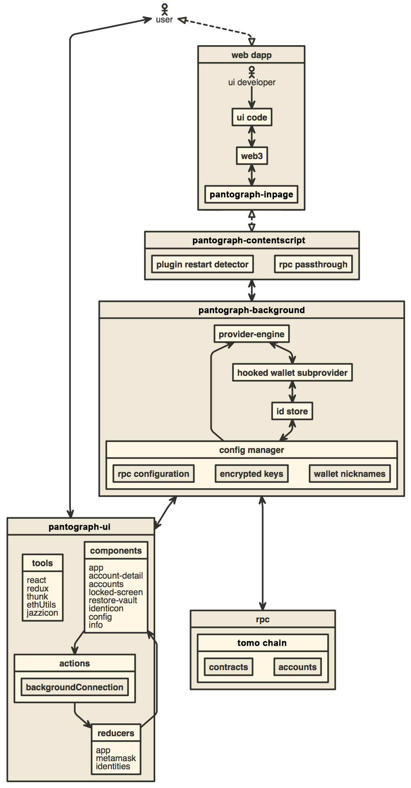

# Pantograph Browser Extension

You can find the latest version of Pantograph on [our official website](https://pantograph.io/). For help using Pantograph, visit our [User Support Site](https://change.pantograph.io/inquiry).

Pantograph supports Firefox, Google Chrome, and Chromium-based browsers. We recommend using the latest available browser version.

## How to develop Pantograph-compatible applications

To develop for Pantograph, you're first going to want to get Pantograph installed on your development machine.

Once you have it running, you should find that new browser tabs have a `window.tomochain` object available in the console. This is the way Pantograph provides for you to interact with it.

The first thing your app will want to do is verify whether the user is using Pantograph or not, which is simple using a check like `if (typeof window.tomochain !== 'undefined') { /* deal with it */ }`

## Building locally

- Install [Node.js](https://nodejs.org) version 10
    - If you are using [nvm](https://github.com/creationix/nvm#installation) (recommended) running `nvm use` will automatically choose the right node version for you.
- Install [Yarn](https://yarnpkg.com/en/docs/install)
- Install dependencies: `yarn`
- Build the project to the `./dist/` folder with `yarn dist`.
- Optionally, to start a development build (e.g. with logging and file watching) run `yarn start` instead.
    - To start the [React DevTools](https://github.com/facebook/react-devtools) and [Redux DevTools Extension](http://extension.remotedev.io)
      alongside the app, use `yarn start:dev`.
      - React DevTools will open in a separate window; no browser extension is required
      - Redux DevTools will need to be installed as a browser extension. Open the Redux Remote Devtools to access Redux state logs. This can be done by either right clicking within the web browser to bring up the context menu, expanding the Redux DevTools panel and clicking Open Remote DevTools OR clicking the Redux DevTools extension icon and clicking Open Remote DevTools.
        - You will also need to check the "Use custom (local) server" checkbox in the Remote DevTools Settings, using the default server configuration (host `localhost`, port `8000`, secure connection checkbox unchecked)

Uncompressed builds can be found in `/dist`, compressed builds can be found in `/builds` once they're built.

## Architecture

[][1]

